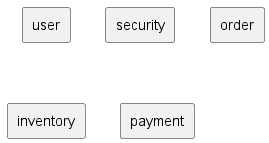
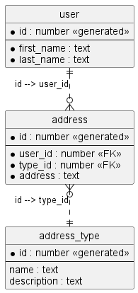

# Database
This directory contains the Data Definition Language files for the database.

The database has the following domains:

- user
- security
- order
- inventory
- payment

Initially, the project will use a single DBMS.  Later iterations will move the security and the payment domains into
separate instances for higher security.

## User Domain

